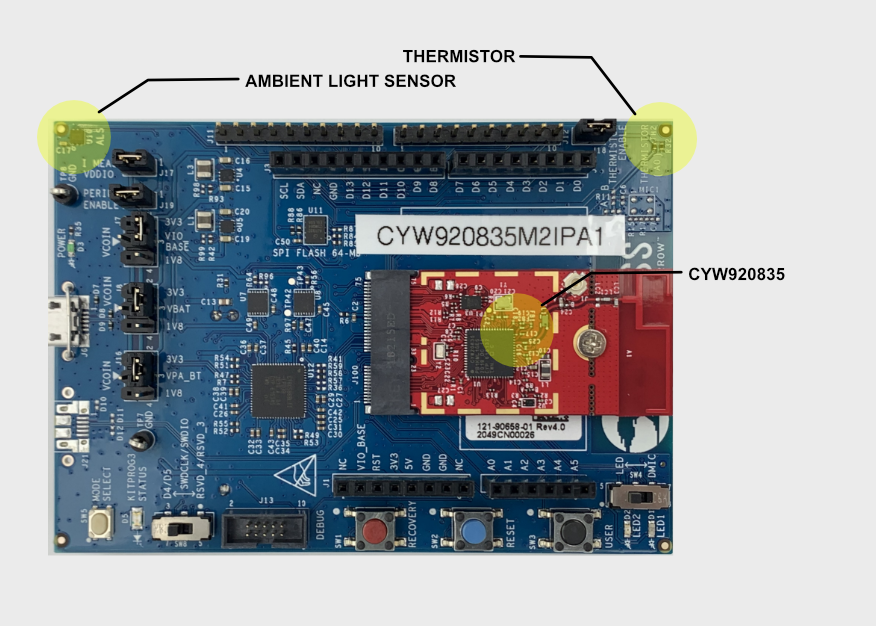
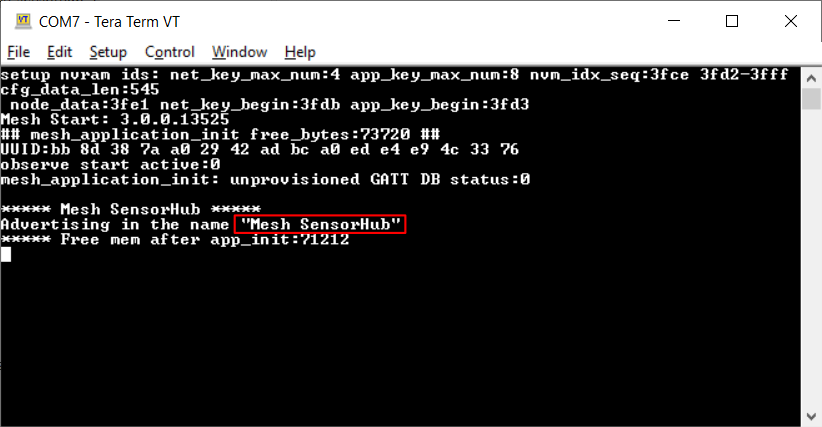
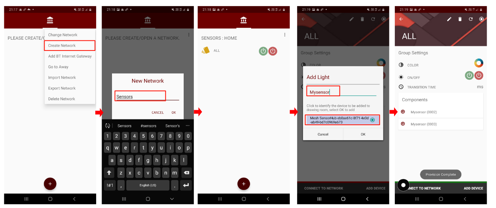
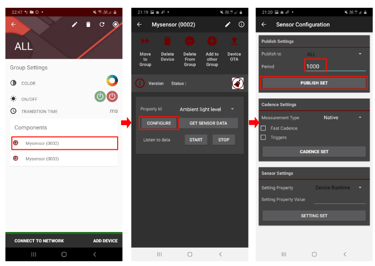
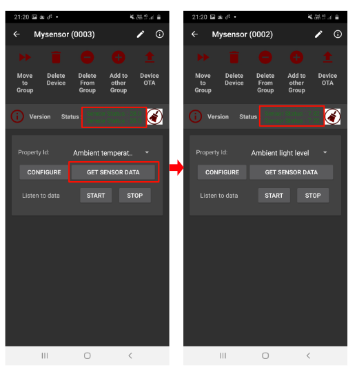
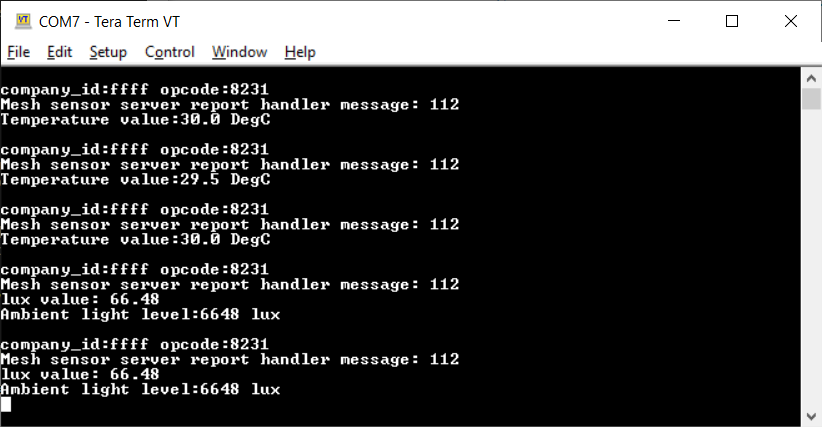
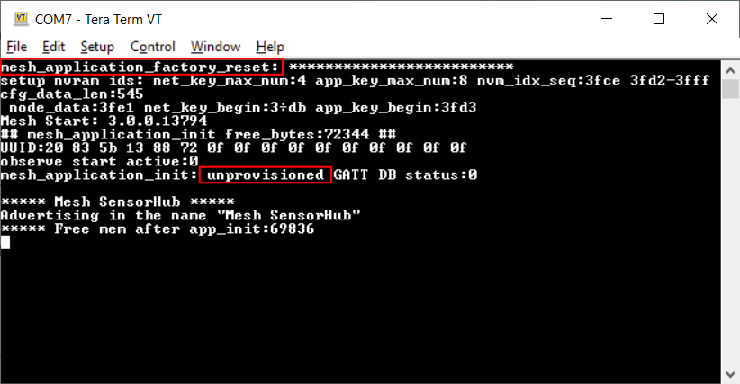
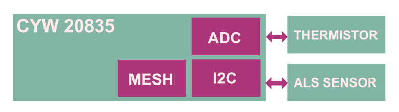

# Mesh SensorHub

This example demonstrates the use of a Bluetooth Low Energy Mesh sensor model with Ambient Light and Temperature sensor interfaced with AIROC™ CYW20835 Bluetooth® LE system-on-chip using ModusToolbox&trade; software.

[Provide feedback on this Code Example.](https://cypress.co1.qualtrics.com/jfe/form/SV_1NTns53sK2yiljn?Q_EED=eyJVbmlxdWUgRG9jIElkIjoiQ0UyMzMwMjUiLCJTcGVjIE51bWJlciI6IjAwMi0zMzAyNSIsIkRvYyBUaXRsZSI6Ik1lc2ggU2Vuc29ySHViIiwicmlkIjoiYXNyYSIsIkRvYyB2ZXJzaW9uIjoiMS4xLjAiLCJEb2MgTGFuZ3VhZ2UiOiJFbmdsaXNoIiwiRG9jIERpdmlzaW9uIjoiTUNEIiwiRG9jIEJVIjoiSUNXIiwiRG9jIEZhbWlseSI6IkJUQUJMRSJ9)

## Requirements

- [ModusToolbox&trade; software](https://www.cypress.com/products/modustoolboxt) v2.3
- Board Support Package (BSP) minimum required version: 3.0.0
- Programming Language: C

Associated parts:
   - [AIROC™ CYW20835 Bluetooth® LE SoC](https://www.cypress.com/products/airoc-bluetooth-le-bluetooth)

## Supported toolchains (make variable 'TOOLCHAIN')

- GNU Arm® Embedded Compiler v9.3.1 (GCC_ARM) - Default value of `TOOLCHAIN`

## Supported kits (make variable 'TARGET')
-  [CYW920835M2EVB-01 Evaluation kit](https://www.cypress.com/products/airoc-bluetooth-le-bluetooth) - Default value of `TARGET`

**Figure 1. Board setup**



## Hardware setup

This example uses the board's default configuration. See the kit user guide to ensure that the board is configured correctly.

The M.2 based Bluetooth baseboard CYW9BTM2BASE1 comes with ambient light sensor and thermistor. The CYW920835M2IPA1 module can be plugged into the M.2 connector.

## Software setup

Install a terminal emulator if you don't have one. Instructions in this document use [Tera Term](https://ttssh2.osdn.jp/index.html.en). All other required software come bundled with the Eclipse IDE for ModusToolbox.

Install Mesh Controller App on mobile. Instructions and Binary at *tools\btsdk-host-peer-apps-mesh\peer\Android\src\bin*.

This example requires no additional software or tools.

## Using the code example

Create the project and open it using one of the following:

<details><summary><b>In Eclipse IDE for ModusToolbox</b></summary>

1. Click the **New Application** link in the **Quick Panel** (or, use **File** > **New** > **ModusToolbox Application**). This launches the [Project Creator](http://www.cypress.com/ModusToolboxProjectCreator) tool.

2. Pick a kit supported by the code example from the list shown in the **Project Creator - Choose Board Support Package (BSP)** dialog.

   When you select a supported kit, the example is reconfigured automatically to work with the kit. To work with a different supported kit later, use the [Library Manager](https://www.cypress.com/ModusToolboxLibraryManager) to choose the BSP for the supported kit. You can use the Library Manager to select or update the BSP and firmware libraries used in this application. To access the Library Manager, click the link from the **Quick Panel**.

   You can also just start the application creation process again and select a different kit.

   If you want to use the application for a kit not listed here, you may need to update the source files. If the kit does not have the required resources, the application may not work.
3. In the **Project Creator - Select Application** dialog, choose the **Mesh SensorHub** application by enabling the checkbox.

4. Optionally, change the suggested **New Application Name**.

5. Enter the local path in the **Application(s) Root Path** field to indicate where the application needs to be created.

   Applications that can share libraries can be placed in the same root path.

6. Click **Create** to complete the application creation process.

For more details, see the [Eclipse IDE for ModusToolbox User Guide](https://www.cypress.com/MTBEclipseIDEUserGuide) (locally available at *{ModusToolbox install directory}/ide_{version}/docs/mt_ide_user_guide.pdf*).

</details>

<details><summary><b>In command-line interface (CLI)</b></summary>

ModusToolbox provides the Project Creator as both a GUI tool and a command line tool to easily create one or more ModusToolbox applications. See the "Project Creator Tools" section of the [ModusToolbox User Guide](https://www.cypress.com/ModusToolboxUserGuide) for more details.

Alternatively, you can manually create the application using the following steps:

1. Download and unzip this repository on to your local machine, or clone the repository.

2. Open a CLI terminal and navigate to the application folder.

   On Windows, use the command line **modus-shell** program provided in the ModusToolbox installation instead of a standard Windows command line application. This shell provides access to all ModusToolbox tools. You can access it by typing `modus-shell` in the search box in the Windows menu.

   In Linux and macOS, you can use any terminal application.

   **Note:** The cloned application contains a default BSP file (*TARGET_xxx.mtb*) in the *deps* folder. Use the [Library Manager](https://www.cypress.com/ModusToolboxLibraryManager) (`make modlibs` command) to select and download a different BSP file, if required. If the selected kit does not have the required resources or is not [supported](#supported-kits-make-variable-target), the application may not work.

3. Import the required libraries by executing the `make getlibs` command.

Various CLI tools include a `-h` option that prints help information to the terminal screen about that tool. For more details, see the [ModusToolbox User Guide](https://www.cypress.com/ModusToolboxUserGuide) (locally available at *{ModusToolbox install directory}/docs_{version}/mtb_user_guide.pdf*).

</details>

<details><summary><b>In Third-party IDEs</b></summary>

1. Follow the instructions from the **In command-line interface (CLI)** section to create the application, and import the libraries using the `make getlibs` command.

2. Export the application to a supported IDE using the `make <ide>` command from the *mtb-example-btsdk-mesh-sensorhub* folder.

    For a list of supported IDEs and more details, see the "Exporting to IDEs" section of the [ModusToolbox User Guide](https://www.cypress.com/ModusToolboxUserGuide) (locally available at *{ModusToolbox install directory}/docs_{version}/mtb_user_guide.pdf*.

3. Follow the instructions displayed in the terminal to create or import the application as an IDE project.

</details>

## Operation

### Using Mesh Controller Mobile app as Bluetooth LE Mesh Client

1. Connect the board to your PC using the provided USB cable through the USB connector.

2. Open a terminal program and select the WICED PUART COM port. Set the serial port parameters to 8N1 and 921600 baud.

3. Program the board with the *mtb-example-btsdk-mesh-sensorhub* application using one of the following:

   <details><summary><b>Using Eclipse IDE for ModusToolbox</b></summary>

      1. Select the application project in the Project Explorer.

      2. In the **Quick Panel**, scroll down, and click **\<Application Name> Program (KitProg3_MiniProg4)**.
      </details>

   <details><summary><b>Using CLI</b></summary>

     From the terminal, execute the `make program` command to build and program the application using the default toolchain to the default target. You can specify a target and toolchain manually:
      ```
      make program TARGET=<BSP> TOOLCHAIN=<toolchain>
      ```

      Example:
      ```
      make program TARGET=CYW920835M2EVB-01 TOOLCHAIN=GCC_ARM
      ```
</details>

4. After programming, the application starts automatically. Confirm that 'Mesh SensorHub' is displayed on the UART terminal. The board starts advertising and LED1 started blinks at 2-Hz frequency.

   **Figure 2. Terminal output for Mesh Sensor Hub during advertising**

   

5. Turn ON Bluetooth on your Android or iOS device and launch the Mesh Controller app. Android Apk and Readme for Mesh Controller app can be found here *tools\btsdk-host-peer-apps-mesh\peer\Android\src\bin*

6. Create a new network on the Mesh Controller app and add a new device with the name "My sensor" or the name of your choice and provision the device. See Figure 3.

   **Figure 3. Provision the device using Android app**

   

   The list is updated with the newly added devices, **Mesh Sensor 001 (ALS)** and **Mesh Sensor 002 (Thermistor)**.

7. Select **Device** and then select the sensor configuration option to update the properties such as **Publish Interval** and **Cadence Settings**. See Figure 4.

   **Figure 4. Sensor Configuration and Settings**

   

8. Click **GET Sensor Data**. The published sensor values are shown on the status. See Figure 5.

   **Figure 5. Getting the sensor data**

   

   Sensor values are displayed on the UART terminal as follows:

   **Figure 6. Sensor data on terminal**

   

9. If user wants to factory reset and unprovision the device. Press and hold of button SW3 for more than Three seconds will do the factory reset
   and put the device into un-provisioned mode. The user LED1 starts blinking at rate of 2HZ See Figure 7.

   **Figure 7. Factory Reset**

   

## Design and implementation

This code example implements a Mesh Server with two elements in the sensor model. Each sensor can be configured individually with different publish intervals and sensor cadence settings. Two timers are used for publishing and cadence processing. The sensor cadence configurations are stored in the NVRAM.

The sensor cadence state determines the frequency with which a sensor publishes status reports relating to each sensor data type (identified by property ID) that needs to be configured. The rate of publication can be configured to vary according to different conditions. When the value falls within a configured range, the publication rate can be increased. If large increases or decreases are measured in the sensor data value, the reporting rate can also be increased. In each case, the fast cadence period divisor indicates by how much the rate of publication should be increased when any of these circumstances arise.

Sensor values are read from the sensor with the help of btsdk-drivers.
1. `ambient_light_sensor_lib` uses I2C communication to configure and read the data from ambient light sensor (MAX44009) registers.
2. `thermistor_ncu15wf104_lib` uses the ADC interface with thermistor to read the temperature values.

   **Figure 8. Design**

   

**Notes:**

1. All Mesh apps use a common shared source library for common application framework functionality located at *mtb\_shared\wiced\_btsdk\dev-kit\libraries\btsdk-mesh\COMPONENT\_mesh\_app\_lib*. You can edit this library as needed. For example, to change the PUART baud rate, see the `_init()` function in *mesh\_app\_hci.c*.

2. The default PUART baud rate is set to 921600, except for BSPs that use the KitProg3 USB Serial bridge device.  Those BSPs default to 3000000, and use two stop bits.

3. The application GATT database is located in *mesh\_app\_lib* in the *mesh\_app\_gatt.c* file. If you create a GATT database using Bluetooth Configurator, update the GATT database in the location mentioned above.

## Application settings

The following application settings are common for all BTSDK applications and can be configured via the Makefile of the application or passed via the command line.

### Application-specific settings

Setting | Description
--------|-----------
MESH\_MODELS\_DEBUG\_TRACES | Turn on debug trace from Mesh Models library
MESH\_CORE\_DEBUG\_TRACES | Turn on debug trace from Mesh Core library

<br>

### Common application settings

Setting | Description
--------|----
BT\_DEVICE\_ADDRESS | Sets the Bluetooth Device Address (BDA) for your device. The address is 6 bytes; for example, 20835B10FFEE. <br> By default, the SDK will set a BDA for your device by combining the 7-digit hex device ID with the last five digits of the host PC MAC address (hex).
UART | Set to the UART port you want to use to download the application. For example `COM6` on Windows, `/dev/ttyWICED\_HCI\_UART0` on Linux, or `/dev/tty.usbserial-000154` on macOS. <br> By default, the SDK will auto-detect the port.
ENABLE_DEBUG | For HW debugging, configure ENABLE\_DEBUG=1. See the document [WICED-Hardware-Debugging](https://github.com/cypresssemiconductorco/btsdk-docs/blob/master/docs/BT-SDK/WICED-Hardware-Debugging.pdf) for more information. This setting configures GPIO for SWD.<br>

<br>

### Application source files

|**File Name**|**Description**|
|--------------------|------------------------------------|
| *main.c* | Entry to the application, sensor initialization, Mesh Server initialization, and LED implementation |
| *mesh_cfg.c, mesh_cfg.h* | Mesh configuration and structure for sensor model|
| *mesh_server.c, mesh_server.h* | Mesh sensor server implementation and handling the mesh event callbacks|
| *sensors.c, sensor.h* | Sensor API implementation for ambient light sensor and thermistor|

## Resources and settings

This section explains the ModusToolbox resources and their configuration as used in this code example. Note that the configuration explained in this section has already been done in the code example. Eclipse IDE for ModusToolbox stores the configuration settings of the application in the *design.modus* file. This file is used by the graphical configurators, which generate the configuration firmware. This firmware is stored in the application’s *GeneratedSource* folder.

* **Device Configurator:** Used for enabling/configuring the peripherals and the pins used in the application. See the
[Device Configurator Guide](https://www.cypress.com/ModusToolboxDeviceConfig).

* **Bluetooth Configurator:** Used for generating/modifying the Bluetooth LE GATT database. See the
[Bluetooth Configurator Guide](https://www.cypress.com/ModusToolboxBLEConfig).

* **Peer apps:** Applications that run on Windows, iOS or Android and act as peer Bluetooth apps to demonstrate specific profiles or features, communicating with embedded apps over the air,
   LE apps location:  \<Workspace Dir>\wiced\_btsdk\tools\btsdk-peer-apps-ble<br>
   LE Mesh apps location:  \<Workspace Dir>\wiced\_btsdk\tools\btsdk-host-peer-apps-mesh\peer<br>
   OTA apps location:  \<Workspace Dir>\wiced\_btsdk\tools\btsdk-peer-apps-ota

* **LE Mesh Client Control:** Similar to the above app, this application emulates host MCU applications for LE Mesh models.
It can configure and provision mesh devices and create mesh networks. The application is located in the folder below. For more
information, see readme.txt in the same folder.
This utility can be run directly from the filesystem, or it can be run from the Tools section of the ModusToolbox IDE QuickPanel
(if a mesh-capable project is selected in the IDE Project Explorer pane), or by right-clicking a mesh-capable project in the IDE Project Explorer pane and selecting the ModusToolbox context menu. 
The full version is provided for Windows (VS\_ClientControl) supporting all Mesh models.<br> A limited version supporting only the Lighting model (QT\_ClientControl) is provided for Windows, Linux, and macOS.<br>
Location:  \<Workspace Dir>\wiced_btsdk\tools\btsdk-host-peer-apps-mesh\host

## Related resources

| Application notes                                            |                                                              |
| :----------------------------------------------------------- | :----------------------------------------------------------- |
| [AN225684](http://www.cypress.com/an225684):  Getting started with CYW208xx | Describes the CYW208xx device and how to build your first ModusToolbox project |
|**Code examples**| Visit the [Cypress GitHub repo](https://www.cypress.com/mtb-github) for a comprehensive collection of code examples using Eclipse IDE for ModusToolbox|
|**Device documentation**| [CYW20835 device datasheet](https://www.cypress.com/products/airoc-bluetooth-le-bluetooth)<br> [CYW920721 device datasheet](https://www.cypress.com/products/cyw20721)<br> [CYW20819 device datasheet](https://www.cypress.com/datasheet/CYW20819)<br> [CYW20820 device datasheet](https://www.cypress.com/datasheet/CYW20820) <br> [CYW20719 device datasheet](https://www.cypress.com/documentation/datasheets/cyw20719-enhanced-low-power-bredrble-bluetooth-50-soc)<br> [CYW20735 device datasheet](https://www.cypress.com/documentation/datasheets/cyw20735b1-single-chip-bluetooth-transceiver-wireless-input-devices)|
|**Development kits**| [CYW920835M2EVB-01](https://github.com/cypresssemiconductorco/TARGET_CYW920835M2EVB-01)<br> [CYW920721M2EVK-02](https://github.com/cypresssemiconductorco/TARGET_CYW920721M2EVK-02) <br> [CYW920819EVB-02 evaluation kit](http://www.cypress.com/CYW920819EVB-02) <br> [CYW920820EVB-02 evaluation kit](http://www.cypress.com/CYW920820EVB-02)<br> [CYW920719B2Q40EVB-01 evaluation kit](https://community.cypress.com/docs/DOC-17736) <br>[CYW920735Q60EVB-01 evaluation kit](http://www.cypress.com/CYW920735Q60EVB-01)|
|**Tools**|
|[Eclipse IDE for ModusToolbox](https://www.cypress.com/modustoolbox)    | The cross-platform, Eclipse-based IDE for IoT designers that supports application configuration and development targeting converged MCU and wireless systems.             |

## Other resources

Cypress provides a wealth of data at www.cypress.com to help you select the right device, and quickly and effectively integrate it into your design.

For more detail about Bluetooth MESH spec, see [MESH Profile](https://www.bluetooth.com/specifications/specs/mesh-profile-1-0-1/) and
[MESH Model](https://www.bluetooth.com/specifications/specs/mesh-model-1-0-1/).


## Document history

Document title: *CE233025* - *Mesh SensorHub*

| Version | Description of change |
| ------- | --------------------- |
| 1.0.0   | New code example      |
| 1.1.0   | Lib version correction   |
------

All other trademarks or registered trademarks referenced herein are the property of their respective owners.


-------------------------------------------------------------------------------

© Cypress Semiconductor Corporation, 2020-2021. This document is the property of Cypress Semiconductor Corporation, an Infineon Technologies company, and its affiliates ("Cypress").  This document, including any software or firmware included or referenced in this document ("Software"), is owned by Cypress under the intellectual property laws and treaties of the United States and other countries worldwide.  Cypress reserves all rights under such laws and treaties and does not, except as specifically stated in this paragraph, grant any license under its patents, copyrights, trademarks, or other intellectual property rights.  If the Software is not accompanied by a license agreement and you do not otherwise have a written agreement with Cypress governing the use of the Software, then Cypress hereby grants you a personal, non-exclusive, nontransferable license (without the right to sublicense) (1) under its copyright rights in the Software (a) for Software provided in source code form, to modify and reproduce the Software solely for use with Cypress hardware products, only internally within your organization, and (b) to distribute the Software in binary code form externally to end users (either directly or indirectly through resellers and distributors), solely for use on Cypress hardware product units, and (2) under those claims of Cypress’s patents that are infringed by the Software (as provided by Cypress, unmodified) to make, use, distribute, and import the Software solely for use with Cypress hardware products.  Any other use, reproduction, modification, translation, or compilation of the Software is prohibited.
<br>
TO THE EXTENT PERMITTED BY APPLICABLE LAW, CYPRESS MAKES NO WARRANTY OF ANY KIND, EXPRESS OR IMPLIED, WITH REGARD TO THIS DOCUMENT OR ANY SOFTWARE OR ACCOMPANYING HARDWARE, INCLUDING, BUT NOT LIMITED TO, THE IMPLIED WARRANTIES OF MERCHANTABILITY AND FITNESS FOR A PARTICULAR PURPOSE.  No computing device can be absolutely secure.  Therefore, despite security measures implemented in Cypress hardware or software products, Cypress shall have no liability arising out of any security breach, such as unauthorized access to or use of a Cypress product.  CYPRESS DOES NOT REPRESENT, WARRANT, OR GUARANTEE THAT CYPRESS PRODUCTS, OR SYSTEMS CREATED USING CYPRESS PRODUCTS, WILL BE FREE FROM CORRUPTION, ATTACK, VIRUSES, INTERFERENCE, HACKING, DATA LOSS OR THEFT, OR OTHER SECURITY INTRUSION (collectively, "Security Breach").  Cypress disclaims any liability relating to any Security Breach, and you shall and hereby do release Cypress from any claim, damage, or other liability arising from any Security Breach.  In addition, the products described in these materials may contain design defects or errors known as errata which may cause the product to deviate from published specifications.  To the extent permitted by applicable law, Cypress reserves the right to make changes to this document without further notice. Cypress does not assume any liability arising out of the application or use of any product or circuit described in this document.  Any information provided in this document, including any sample design information or programming code, is provided only for reference purposes.  It is the responsibility of the user of this document to properly design, program, and test the functionality and safety of any application made of this information and any resulting product.  "High-Risk Device" means any device or system whose failure could cause personal injury, death, or property damage.  Examples of High-Risk Devices are weapons, nuclear installations, surgical implants, and other medical devices.  "Critical Component" means any component of a High-Risk Device whose failure to perform can be reasonably expected to cause, directly or indirectly, the failure of the High-Risk Device, or to affect its safety or effectiveness.  Cypress is not liable, in whole or in part, and you shall and hereby do release Cypress from any claim, damage, or other liability arising from any use of a Cypress product as a Critical Component in a High-Risk Device.  You shall indemnify and hold Cypress, including its affiliates, and its directors, officers, employees, agents, distributors, and assigns harmless from and against all claims, costs, damages, and expenses, arising out of any claim, including claims for product liability, personal injury or death, or property damage arising from any use of a Cypress product as a Critical Component in a High-Risk Device.  Cypress products are not intended or authorized for use as a Critical Component in any High-Risk Device except to the limited extent that (i) Cypress’s published data sheet for the product explicitly states Cypress has qualified the product for use in a specific High-Risk Device, or (ii) Cypress has given you advance written authorization to use the product as a Critical Component in the specific High-Risk Device and you have signed a separate indemnification agreement.
<br>
Cypress, the Cypress logo, and combinations thereof, WICED, ModusToolBox, PSoC, CapSense, EZ-USB, F-RAM, and Traveo are trademarks or registered trademarks of Cypress or a subsidiary of Cypress in the United States or in other countries.  For a more complete list of Cypress trademarks, visit cypress.com.  Other names and brands may be claimed as property of their respective owners.
